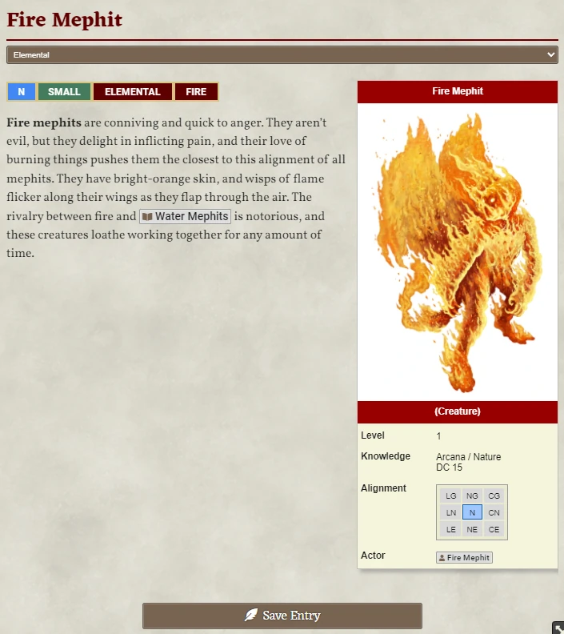

# FatBaby's Compendium Library

A simple styling library for journal entries.

Provides

* PF2E Traits
* Floating Infobox
* Floating thumb and infobox images
  * Clickable to view larger image
* A 9-way alignment table

## Changelog
